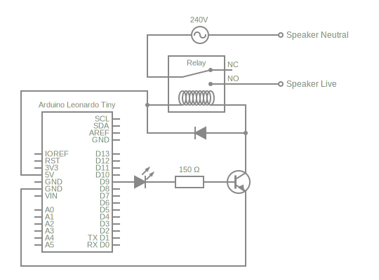
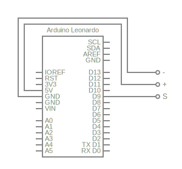

# Speaker-Controller
Automatically turn my desk speakers on/off when I change the audio output in Windows.

## Circuit Diagram
This is a rough diagram of the circuit I'm using to control the speakers:

In reality, all of the discreet components are part of [this board](https://www.jaycar.co.nz/arduino-compatible-5v-relay/p/XC4419), and connected to the Arduino like so:

