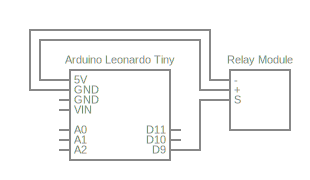
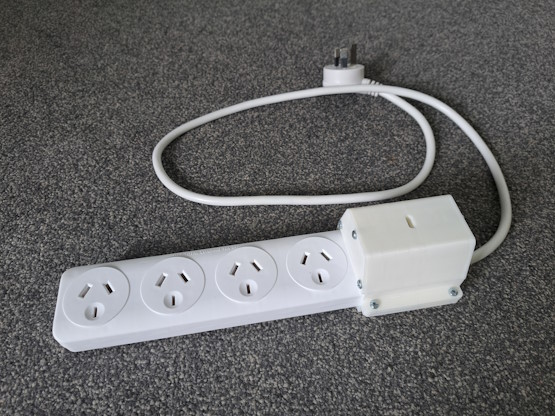

# Speaker Controller
**Automatically turns my desk speakers on/off when I change the audio output in Windows.**

Well, that's what I'm using this project for anyway. Although, it's essentially just a smart power bar - you can use it to switch any household appliance on/off.

> [!WARNING]
> This project deals with dangerous mains voltages. Do not attempt to replicate this project unless you are experienced with the hazards involved and are using the appropriate safety equipment.

 

## Bill of Materials
Components and materials I used:
- [Duinotech Leonardo Tiny](https://www.jaycar.co.nz/leonardo-tiny-atmega32u4-main-board/p/XC4431)
- [Arduino Compatible 5V Relay](https://www.jaycar.co.nz/arduino-compatible-5v-relay/p/XC4419)
- [This random power bar](https://www.kmart.co.nz/product/arlec-4-outlet-surge-protected-powerboard-42153580/)
- [10⨯ M2.5⨯9 self-tapping screws](https://www.bunnings.co.nz/zenith-4g-x-9mm-sheet-metal-self-tappers-pan-head-slotted-phillips-drive-screws-100-pack_p2435782)
- ~20m/~60g of [1.75mm filament](https://www.bits4bots.co.nz/products/esun-pla-1-75mm-1kg?variant=43675171356827)

 

## Circuit
This is a rough diagram of the circuit I'm using to control the speakers:  

In reality, all of the discreet components are part of [this board](https://www.jaycar.co.nz/arduino-compatible-5v-relay/p/XC4419), and connected to the [Arduino](https://www.jaycar.co.nz/leonardo-tiny-atmega32u4-main-board/p/XC4431) like so:  

 

## Code
### Arduino
Code for the Arduino is located in the [`sketch`](./sketch/) directory.  
This program simply listens for characters being sent by the USB host and toggles the relay's state accordingly. If the program receives a `'1'` the relay is turned on, `'0'` the relay is turned off.

### PC
The script to be run on the connected PC is in the [`controller`](./controller/) directory.  
This script runs in the background, polling the registry for updates to the default audio output device. When the default device changes, it notifies the Arduino.

> [!NOTE]
> You'll need to run `cd controller && npm i` before running this script for the first time.

 

## Housing
The [`models`](./models/) directory contains some housing models that fit with [my particular power bar](https://www.kmart.co.nz/product/arlec-4-outlet-surge-protected-powerboard-42153580/).

You can also find the [model source on OnShape](https://cad.onshape.com/documents/b996f80e98ba7dbd92c3a90e/w/50b2495923acaf03b7d63635/e/e429f6e0665596681b5c2419?renderMode=0&uiState=6615ad4f92329a0588dcb680).

I printed these with eSun White PLA+, and the following settings:
- 0.4mm nozzle
- 0.2mm layer height
- 3 wall layers
- 15% infill density

 

## Images
Fully assembled:  

The Arduino and relay are slid into the right side of the housing:  

With the cover on, the USB port is accessible from this side of the device:  

On the opposite side, the two ends of the live wire are inserted into the screw terminals on the relay board:  

The terminals can be tightened down through a small hole in the top of the housing:  

*You can find full-size versions of these images in the [`images`](./images/) directory.*
